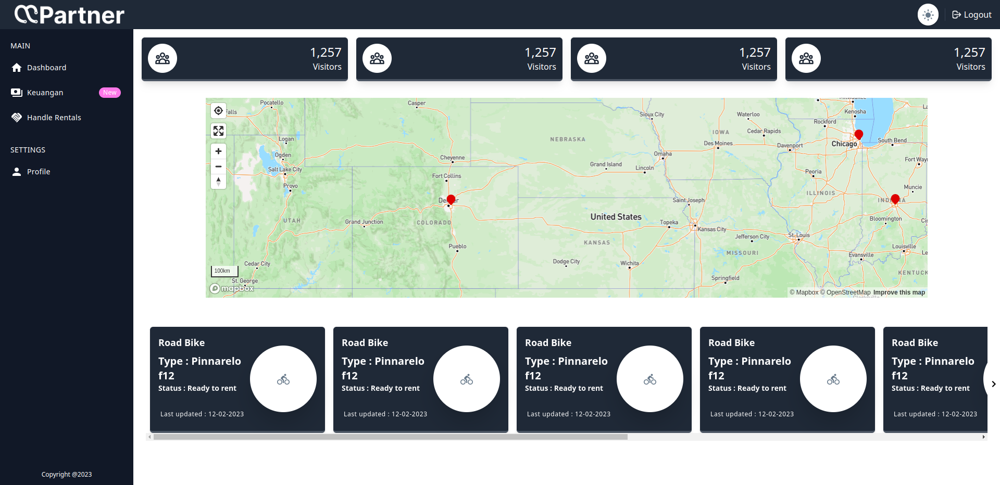

<div align="center">

<h1 style="border-bottom: none">
    <b><a href="#">MOPARTNER</a></b><br />
    Dashboard Partner to easy control business rental & realtime monitoring device
    <br>
</h1>

<div>

 

</div>

<div align='left'>

## Built with

- [ViteJS](https://vitejs.dev/) - modern web applications using reactjs
- [Tailwindcss](https://tailwindcss.com/docs/guides/vite) - css framework
- [MaterialUI](https://mui.com/material-ui/material-icons/) - React component
- [react-map-gl](https://github.com/visgl/react-map-gl) - Mapbox GL JS Components
- [TypeScript](https://github.com/microsoft/TypeScript) and [ES6](https://github.com/eslint/eslint) - for both client and server sides

## Getting Started

To start a client, go into the client folder and install dependencies/run start command:

```bash
yarn && yarn dev
```

## Credits 🎉

Part Of Mosfitech

## License

This project is licensed under MIT.

</div>
